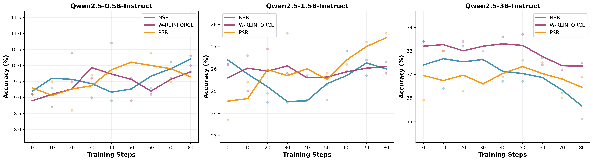
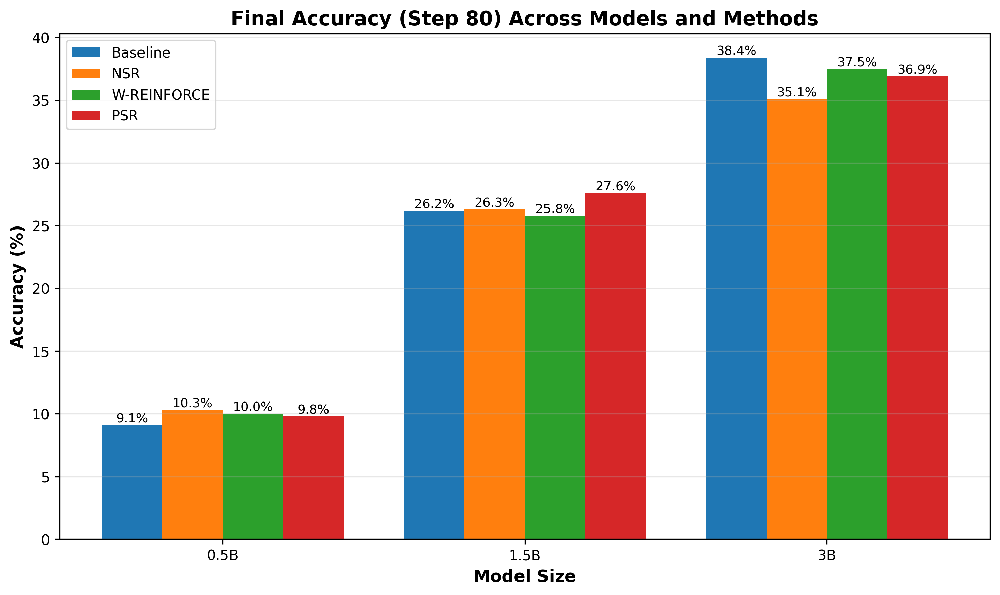

# Small-scale RLVR Decomposed on MATH Dataset

## 🎬 RLVR Decomposition Animation

https://github.com/user-attachments/assets/60a33aeb-1cad-47d2-a3b1-29c0c6554579

*This animation visualizes the decomposition of the RLVR objective into PSR (Positive Sample Reinforcement) and NSR (Negative Sample Reinforcement) components.*

## 📋 Overview

This repository implements and investigates the effectiveness of Negative Sample Reinforcement (NSR), Weighted REINFORCE (W-REINFORCE), and Positive Sample Reinforcement (PSR) objectives on mathematical reasoning tasks using the MATH dataset. The work is an extension of the paper "The Surprising Effectiveness of Negative Reinforcement in LLM Reasoning" (Zhu et al., 2025) and explores how these reinforcement learning objectives perform across different model sizes and capabilitie (priors).

## ❓ Research Question

**How do NSR and W-REINFORCE objectives change with the model's prior knowledge and capabilities?**

We investigate whether smaller models with less prior mathematical knowledge benefit differently from negative reinforcement compared to larger, more capable models. This study examines the relationship between model size, mathematical reasoning ability, and the effectiveness of different RL objectives.

## 🤖 Models

We conduct experiments across the Qwen2.5 instruction-tuned model family:

- **Qwen2.5-0.5B-Instruct** (0.49B parameters)
- **Qwen2.5-1.5B-Instruct** (1.5B parameters) 
- **Qwen2.5-3B-Instruct** (3B parameters)

These models provide a good range of capabilities while maintaining the same architecture and training methodology, allowing for controlled comparison of how model priors may affect RL objective effectiveness.

## ⚙️ Experimental Configuration

### Training Parameters
- **Max Tokens**: 512
- **Training Steps**: 80
- **Rollout Batch Size**: 64
- **Mini-batch Size**: 32 (64/2 = 32)
- **Temperature**: 1.0 (consistent across all experiments)
- **Rollouts per Prompt**: 2
- **Learning Rate**: 1e-6
- **Gradient Accumulation Steps**: 2
- **PPO Clip Range**: 0.2

We couldn't replicate the paper's parameters due to a lack of compute. 

### Dataset
- **Source**: MATH dataset (Hendrycks et al.)
- **Processing**: Stratified sampling (25% subset) maintaining original train/test distributions
- **Format**: Problems with step-by-step solutions and `\boxed{}` final answers
- **Evaluation**: Answer verification using `math-verify` library

### RL Objectives
1. **NSR (Negative Sample Reinforcement)**: Trains only on incorrect samples with -1.0 reward
2. **PSR (Positive Sample Reinforcement)**: Trains only on correct samples with +1.0 reward  
3. **W-REINFORCE**: Weighted approach with +λ for correct, -1.0 for incorrect samples

## 📊 Results (Pass#1)

### Training Curves

The following visualization shows the training progress across different model sizes and RL objectives. The original data points were noisy, so we smoothed the training curves using moving average with window = 2. 

 

### Final Performance Comparison

The bar chart below compares the final performance of different RL objectives across model sizes:



### Raw Data Points

The following tables show the detailed accuracy measurements at each training step for all RL objectives and model sizes:

#### NSR Results

| Model | Step 0 | Step 10 | Step 20 | Step 30 | Step 40 | Step 50 | Step 60 | Step 70 | Step 80 |
|-------|--------|---------|---------|---------|---------|---------|---------|---------|---------|
| 0.5B  | 9.1%   | 9.3%    | 10.4%   | 9.0%    | 8.9%    | 9.6%    | 9.3%    | 10.1%   | 10.3%   |
| 1.5B  | 26.2%  | 26.6%   | 24.5%   | 24.5%   | 24.6%   | 24.6%   | 26.8%   | 25.7%   | 26.3%   |
| 3B    | 38.4%  | 36.4%   | 38.2%   | 38.0%   | 36.7%   | 36.7%   | 37.7%   | 36.2%   | 35.1%   |

#### W-REINFORCE Results

| Model | Step 0 | Step 10 | Step 20 | Step 30 | Step 40 | Step 50 | Step 60 | Step 70 | Step 80 |
|-------|--------|---------|---------|---------|---------|---------|---------|---------|---------|
| 0.5B  | 9.1%   | 8.7%    | 9.5%    | 9.6%    | 10.7%   | 8.9%    | 9.1%    | 9.6%    | 10.0%   |
| 1.5B  | 26.2%  | 25.0%   | 26.9%   | 25.8%   | 25.7%   | 25.3%   | 25.9%   | 26.4%   | 25.8%   |
| 3B    | 38.4%  | 38.0%   | 38.4%   | 37.6%   | 38.6%   | 38.7%   | 37.4%   | 37.2%   | 37.5%   |

#### PSR Results

| Model | Step 0 | Step 10 | Step 20 | Step 30 | Step 40 | Step 50 | Step 60 | Step 70 | Step 80 |
|-------|--------|---------|---------|---------|---------|---------|---------|---------|---------|
| 0.5B  | 9.1%   | 9.5%    | 8.6%    | 9.7%    | 9.8%    | 10.1%   | 10.4%   | 9.5%    | 9.8%    |
| 1.5B  | 23.7%  | 25.4%   | 24.9%   | 27.6%   | 24.6%   | 25.8%   | 26.2%   | 27.2%   | 27.6%   |
| 3B    | 35.9%  | 38.0%   | 36.3%   | 36.6%   | 36.9%   | 37.6%   | 37.5%   | 36.0%   | 36.9%   |

### Main Findings

Overall, we find that under a resource-constrained setting, the three reinforcement learning methods—NSR, W-REINFORCE, and PSR—either fail to yield meaningful gains or only marginally improve upon the base model.

* For the 0.5B and 1.5B models, all three methods largely maintained baseline performance, achieving only minor accuracy increases over 80 training steps.
* For the 3B model, performance degraded.

We attribute these outcomes primarily to the limited number of effective training samples. The rollout batch size was already small, and both NSR and PSR further reduced usable data by filtering trajectories. W-REINFORCE suffers from a similar issue: although it retains all samples, it heavily down-weights positive examples (by 0.1×), concentrating updates on a small subset of negative samples. This reduction in effective signal weakens gradient updates and results in minimal or negative performance changes. 

**Given the resource constraints, it remains inconclusive whether model-specific priors influence the relative effectiveness of these methods.**

## 🚀 Usage

### Running Experiments

```bash
# NSR with 0.5B model
python MATH_experiment.py --objective NSR --model_id Qwen/Qwen2.5-0.5B-Instruct

# W-REINFORCE with 3B model  
python MATH_experiment.py --objective W_REINFORCE --model_id Qwen/Qwen2.5-3B-Instruct

# PSR with 1.5B model
python MATH_experiment.py --objective PSR --model_id Qwen/Qwen2.5-1.5B-Instruct
```

## 📦 Dependencies

- PyTorch >= 2.0.0
- Transformers >= 4.35.0
- vLLM >= 0.2.0
- math-verify >= 0.1.0
- Datasets >= 2.14.0
- TensorBoard >= 2.14.0


## 🙏 Acknowledgments

- Inspired by "The Surprising Effectiveness of Negative Reinforcement in LLM Reasoning" by Zhu et al.
- Built on the MATH dataset by Hendrycks et al.
- Uses Qwen2.5 models by Alibaba Cloud
